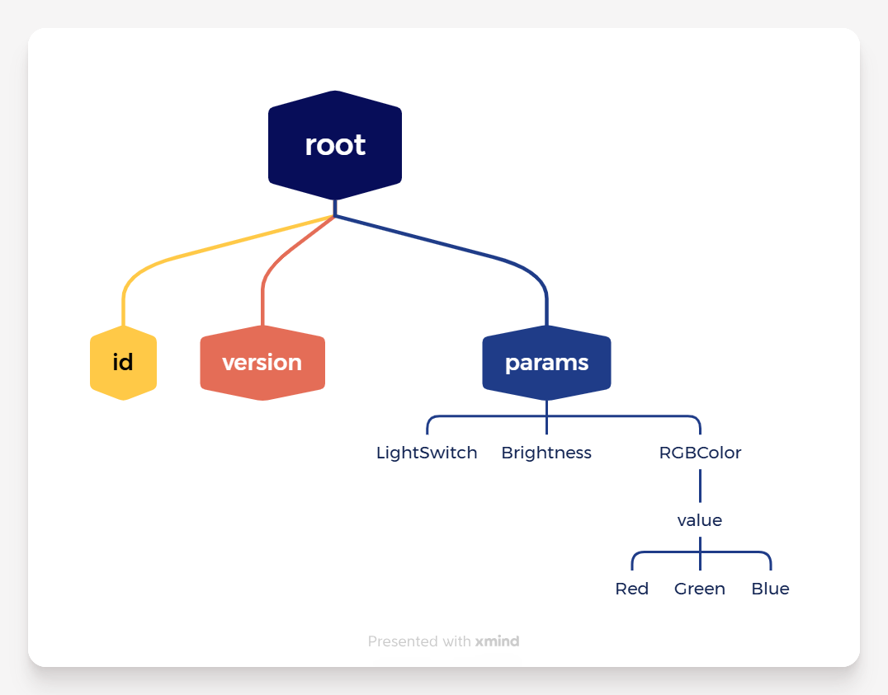

# Cjson简单函数解释

[toc]

## 0. ==总览==

| **函数**                  | **用法**   | **例子**                                                     |
| ------------------------- | ---------- | ------------------------------------------------------------ |
| **创建端**                |            |                                                              |
| `cJSON_CreateObject`      | 创建空对象 | `cJSON* root = cJSON_CreateObject();`                        |
| **构建端**                |            |                                                              |
| `cJSON_AddStringToObject` | 添加字符串 | `cJSON_AddStringToObject(root,"id","123");`                  |
| `cJSON_AddNumberToObject` | 添加数字   | `cJSON_AddNumberToObject(brightness_js,"value",led_brightness);` |
| `cJSON_AddBoolToObject`   | 添加布尔值 | `cJSON_AddBoolToObject(light_js,"value",led_status);`        |
| `cJSON_AddObjectToObject` | 添加子对象 | `cJSON* color_js = cJSON_AddObjectToObject(params_js,"RGBColor");` |
| **获取端**                |            |                                                              |
| `cJSON_GetObjectItem`     | 获取子对象 | `cJSON *params_js = cJSON_GetObjectItem(property_js,"params");` |
| `cJSON_GetNumberValue`    | 获取数字   | `led_brightness = cJSON_GetNumberValue(name_js);`            |
| `cJSON_IsTrue`            | 判断布尔值 | `if(cJSON_IsTrue(name_js)) { ... }` `else`                   |
| `cJSON_IsString`          | 判断字符串 | `cJSON_IsString(name_item)``name_item->valuestring得到字符串` |

## 1. 创建 JSON 对象

### `cJSON* cJSON_CreateObject(void);`

- **作用**：创建一个空的 JSON 对象 `{}`
- **返回值**：`cJSON*` 指针，表示创建的 JSON 对象
- **典型用法**：

```
cJSON* root = cJSON_CreateObject();  // 创建一个空对象
```

------

## 2. 向 JSON 对象中添加 **字符串**

### `cJSON* cJSON_AddStringToObject(cJSON *object, const char *name, const char *string);`

- **作用**：在对象 `object` 中添加一个 **键值对**，值是字符串
- **参数**：
  - `object`：父对象
  - `name`：属性名
  - `string`：字符串值
- **返回值**：添加的 cJSON 节点指针
- **示例**：

```
cJSON_AddStringToObject(root, "id", "123");
cJSON_AddStringToObject(root, "version", "1.0");
```

效果生成：

```
{
  "id": "123",
  "version": "1.0"
}
```

------

## 3. 向 JSON 对象中添加 **数字**

### `cJSON* cJSON_AddNumberToObject(cJSON *object, const char *name, double number);`

- **作用**：在对象中添加键值对，值是数字
- **参数**：
  - `object`：父对象
  - `name`：属性名
  - `number`：数值
- **示例**：

```
cJSON_AddNumberToObject(brightness_js, "value", led_brightness);
```

生成：

```
"Brightness": {"value": 50}
```

------

## 4. 向 JSON 对象中添加 **布尔值**

### `cJSON* cJSON_AddBoolToObject(cJSON *object, const char *name, cJSON_bool boolean);`

- **作用**：在对象中添加键值对，值是 `true/false`
- **参数**：
  - `object`：父对象
  - `name`：属性名
  - `boolean`：`cJSON_True` 或 `cJSON_False`，也可以用 C 的 `1/0`
- **示例**：

```
cJSON_AddBoolToObject(light_js, "value", led_status);
```

生成：

```
"LightSwitch": {"value": true}
```

------

## 5. 添加子对象

### `cJSON* cJSON_AddObjectToObject(cJSON *object, const char *name);`

- **作用**：在父对象中添加一个新的 **JSON 对象**
- **返回值**：新创建的子对象指针
- **示例**：

```
cJSON* params_js = cJSON_AddObjectToObject(root, "params");
cJSON* light_js = cJSON_AddObjectToObject(params_js, "LightSwitch");
```

效果：

```
{
  "params": {
    "LightSwitch": {}
  }
}
```

然后可以再向 `light_js` 添加 `value` 等字段。

------

## 6. 获取 JSON 对象中的子对象

### `cJSON* cJSON_GetObjectItem(cJSON *object, const char *string);`

- **作用**：获取对象中指定键对应的节点
- **参数**：
  - `object`：父对象
  - `string`：键名
- **返回值**：对应节点指针，找不到返回 `NULL`
- **示例**：

```
cJSON *params_js = cJSON_GetObjectItem(property_js, "params");
```

- 如果 `property_js` 是：

```
{"params":{"LightSwitch":{"value":true}}}
```

- `params_js` 就是 `{ "LightSwitch": {"value": true} }`

------

### `cJSON* cJSON_GetObjectItemCaseSensitive(cJSON *object, const char *string);`

- 区分大小写版本（cJSON 还有不区分大小写的版本）

------

## 7. **遍历 JSON 对象的子节点**

- `cJSON` 对象是 **链表结构**
- `cJSON->child` 指向第一个子节点
- `cJSON* next = name_js->next` 指向下一个兄弟节点
- 在你的代码里：

```
cJSON *name_js = params_js->child;
while(name_js)
{
    // 处理 name_js
    name_js = name_js->child;   // 注意：这里通常用 name_js = name_js->next
}
```

> ⚠️ 你的代码里 `name_js = name_js->child;` 有点问题，标准遍历兄弟节点应该用 `name_js = name_js->next;`

------

## 8. 获取 JSON 节点的数值

### `double cJSON_GetNumberValue(const cJSON *item);`

- **作用**：获取 JSON 节点的数字值
- **返回值**：double 类型
- **示例**：

```
led_brightness = cJSON_GetNumberValue(name_js);
```

- 如果 JSON 是：

```
"Brightness": {"value": 50}
```

- `name_js` 应该是指 `"value"` 节点，然后获取到 50

------

## 9. 判断布尔值

### `cJSON_IsTrue(const cJSON *item);`

- **作用**：判断节点是否为 true
- **示例**：

```
if(cJSON_IsTrue(name_js)) { ... }
```

### `cJSON_IsFalse(const cJSON *item);`

- 判断是否为 false

# Cjson实现简单库封装

## 1. 解析上位机数据属性配置消息

```c
// 解析上位机数据属性配置消息
void onenet_property_handle(cJSON* property_js)
{
    cJSON *params_js = cJSON_GetObjectItem(property_js,"params");
    if(params_js)
    {
        cJSON *name_js = params_js->child;	// 第1个孩子
        while(name_js)
        {
            // 分类1:bool值
            if(strcmp(name_js->string,"bool值的名字") == 0)
            {
                if(cJSON_IsTrue(name_js))
                {
                    // bool值为true
                    
                }
                else
                {
                    // bool值为false
                    
                }
            }
            // 分类2:int类型数据
            else if(strcmp(name_js->string,"int类型数据名") == 0)
            {
                // 得到数据
                int类型数据名 = cJSON_GetNumberValue(name_js);
                // 执行逻辑
            }
            // 分类3:String类型数据
            else if (strcmp(name_js->string,"String类型数据名") == 0 && cJSON_IsString(name_js))
             {
				// 得到String值
                char* get_string = name_js->valuestring ;
             }
            // 分类4:集合数据,需要再次得到child:
            else if(strcmp(name_js->string,"集合数据名") == 0)
            {
                cJSON *child = name_js->child;
                while(child)
                {
                    // 回到前3类逻辑,执行逻辑
                    
                    child = child->next;
                }
            }
            name_js = name_js->next;         // 移动到下一个兄弟节点
        }
    }
}
```


## 2. 发送数据信息给上位机

* 例：数据格式

```c
// root (cJSON object)
{
    "id"       : "123",        // 字符串
    "version"  : "1.0",        // 字符串
    "params"   : {              	// cJSON object
        	"LightSwitch" : {       // cJSON object
            "value" : led_status    // bool
        },
        	"Brightness"  : {       // cJSON object
            "value" : led_brightness// 数字
        },
            "RGBColor"    : {      			// cJSON object
                    "value" : {       		// cJSON object
                        "Red"   : ws2812_red,   // 数字
                        "Green" : ws2812_green, // 数字
                        "Blue"  : ws2812_blue   // 数字
                    }
            }
    }
}
```

* 代码

```c
cJSON* onenet_property_upload_dm(void)
{
    // 顶级
    cJSON* root = cJSON_CreateObject(); // 必写
    // 第1级
    cJSON_AddStringToObject(root,"id","123");	// 必写
    cJSON_AddStringToObject(root,"version","1.0"); // 必写
    cJSON* params_js = cJSON_AddObjectToObject(root,"params");	// 必写,要留下params用于构建下一级
    // 第2级
    //灯开关:bool
    cJSON* light_js = cJSON_AddObjectToObject(params_js,"LightSwitch");
    cJSON_AddBoolToObject(light_js,"value",led_status);
    //亮度:int
    cJSON* brightness_js = cJSON_AddObjectToObject(params_js,"Brightness");
    cJSON_AddNumberToObject(brightness_js,"value",led_brightness);
    //RGB:集合
    cJSON* color_js = cJSON_AddObjectToObject(params_js,"RGBColor");
    // 第3级
    cJSON* color_value_js = cJSON_AddObjectToObject(color_js,"value");
    // 第4级
    cJSON_AddNumberToObject(color_value_js,"Red",ws2812_red);
    cJSON_AddNumberToObject(color_value_js,"Green",ws2812_green);
    cJSON_AddNumberToObject(color_value_js,"Blue",ws2812_blue);
    return root;
}
```



## 3. 解析上位机收到的下位机信息后的回显消息


