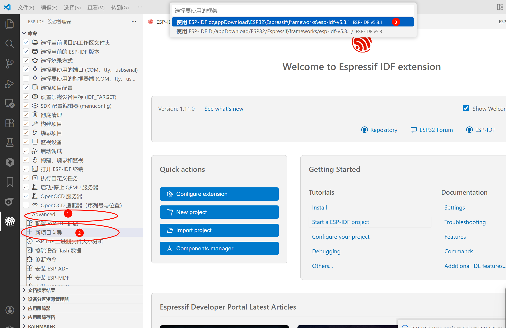
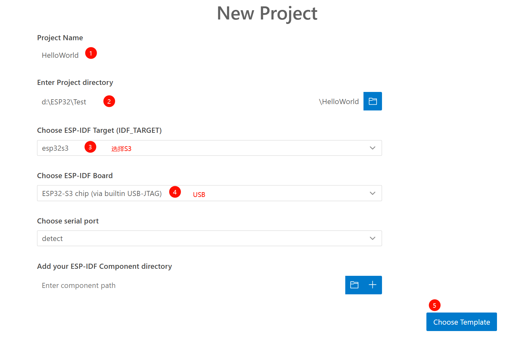
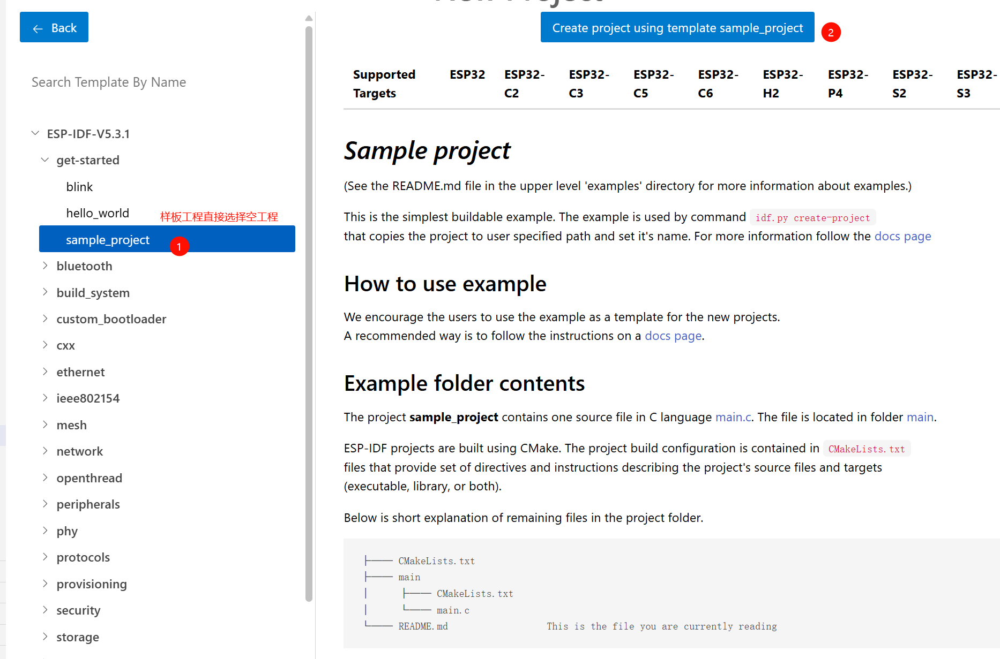
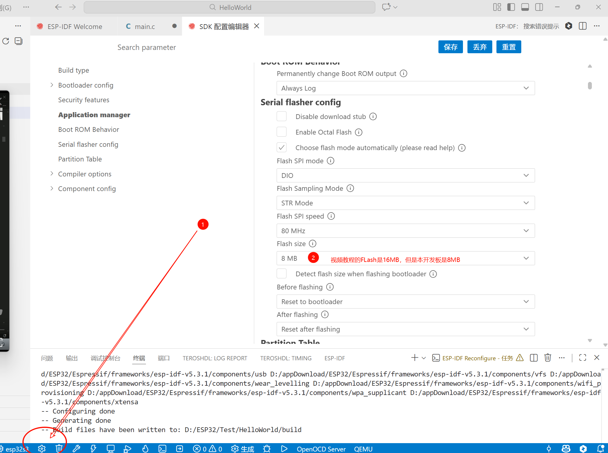
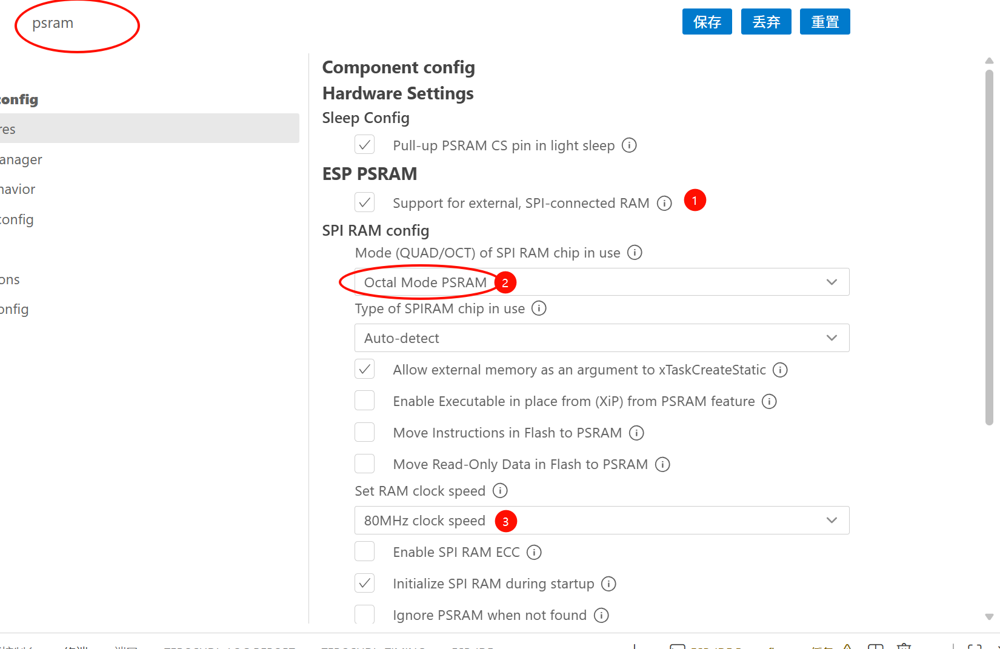
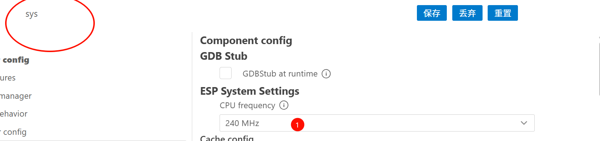

## 1. 创建工程



* 



* 



* 系统配置







* 然后就可以构建项目并且烧录程序了

## 2. 引入文件

* main层:CMakeLists.txt保持原样
* 引入库层：比如`MyLED`库，那么`cmake`需要：

```c
# 通过idf_component_register函数注册组件，相当于实现了自己的自建库函数，记得SRCS后面改名哦.c
idf_component_register(
    SRCS "MyLED.c"			# 库函数.c
    INCLUDE_DIRS "."
    REQUIRES driver			# 因为MyLED库使用了GPIO库,所以需要声明驱动,而GPIO属于driver文件,所以声明driver即可继承
)
# 这里还要进行组件依赖(main函数不需要,因为做了特殊处理，但是其他自设库需要进行这个操作)
# 组件依赖还有传递性,比如MyLED依赖esp_driver_gpio,那么esp_driver_gpio也需要依赖其他组件，比如esp_system,那么esp_system也需要依赖其他组件，以此类推
# 所以在idf_component_register函数中，REQUIRES后面可以写多个组件名，用空格隔开，依赖关系会自动递归处理

# 还有很多组件被存在了云端
# 自己去官网找,然后指令执行
```


## 3. GPIO输出模式-点亮LED

```c
#include "driver/gpio.h"
```

* 初始化GPIO

```c
void led_init(void)
{
    gpio_config_t LED_cfg = {
		// 注意：Dx口和GPIOx不同步,需要查看引脚分配图
        .pin_bit_mask = 1ULL << GPIO_NUM_2,     // GPIO口,需要使用掩码 1ULL << GPIO_NUM_2

        .mode = GPIO_MODE_OUTPUT,               // GPIO模式

        .pull_up_en = GPIO_PULLUP_DISABLE,      // GPIO上下拉:失能

        .pull_down_en = GPIO_PULLDOWN_DISABLE,  // GPIO上下拉:失能

        .intr_type = GPIO_INTR_DISABLE,         // GPIO中断类型:失能

    };

    gpio_config(&LED_cfg);
}
```

* 设置输出状态

```c
// 这里就不需要使用位掩码了
gpio_set_level(GPIO_NUM_2, led_level);
```


## 4. PWM输出

```c
#include "driver/ledc.h"
```


## 5. 硬件IIC驱动OLED

* 核心IIC通信函数

```c
// OLED写命令
void OLED_WriteCommand(uint8_t Command)
{
    uint8_t writebuffer[2];

    writebuffer[0] = 0x00;
    writebuffer[1] = Command;
    ESP_ERROR_CHECK(i2c_master_transmit(oled_dev_handle, writebuffer, 2, -1));
}

// OLED写数据
void OLED_WriteData(uint8_t *Data, uint8_t Count)
{
	uint8_t i;
    uint8_t writebuffer[Count+1];

    writebuffer[0] = 0x40;

    for (i = 0; i < Count; i ++)
	{
		writebuffer[i+1] = Data[i];
	}
    ESP_ERROR_CHECK(i2c_master_transmit(oled_dev_handle, writebuffer, Count+1, -1));
}
```

* IIC 初始化函数
  * 配置IIC总线：所有IIC可以通用
  * 配置从机设备,这里只有OLED，其实还可以有更多，都需要配置从机，记住从机7位地址取原始7位地址

```c
//配置I2C总线
i2c_master_bus_config_t oled_i2c_mst_cfg = 
{
    .clk_source = I2C_CLK_SRC_DEFAULT,      		//使用默认时钟源
    .i2c_port = OLED_I2C_PORT,                      //指定I2C端口号
    .scl_io_num = OLED_SCL,                      	//指定SCL引脚号
    .sda_io_num = OLED_SDA,                      	//指定SDA引脚号
    .glitch_ignore_cnt = 7,                 		//设置毛刺忽略计数
    .flags.enable_internal_pullup = true,  			//禁用内部上拉电阻（前提是已经外部上拉）
};

//创建I2C总线并获取句柄
ESP_ERROR_CHECK(i2c_new_master_bus(&oled_i2c_mst_cfg, &oled_bus_handle));

//配置I2C从机设备
i2c_device_config_t oled_dev_cfg = 
{
    .dev_addr_length = I2C_ADDR_BIT_LEN_7,  	 //设置设备地址长度为7位
    .device_address = OLED_ADD >> 1,             //指定设备地址,这是OLED是8位,所以>>1
    .scl_speed_hz = OLED_SPEED,                  //设置I2C时钟速度
    .flags.disable_ack_check = false,       	 //启用ACK检查
};

//将设备添加到I2C总线并获取设备句柄
ESP_ERROR_CHECK(i2c_master_bus_add_device(oled_bus_handle, &oled_dev_cfg, &oled_dev_handle));
```


## 100. 笔记

### 100-1 库文件依赖

* 基本格式

```c
idf_component_register(SRCS "Timer.c"
                    INCLUDE_DIRS "."
                    REQUIRES driver MyLED)
```


