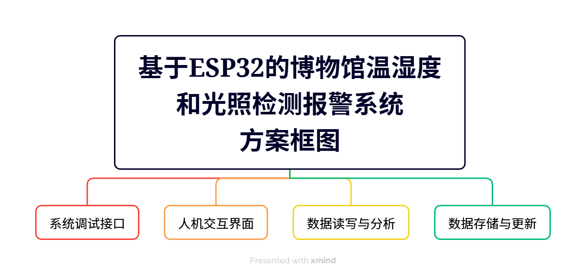
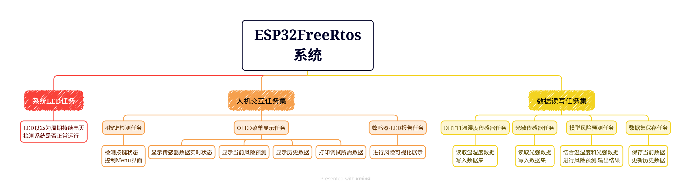

# 1. 所选任务介绍

## 1-1 任务名称

环境预测与场景联动

## 1-2 任务要求

1. 采集温度、湿度、环境光强、震动或倾斜等两种及以上的数据，并间隔一段时间持续记录。  
2. 使用TensorFlow等平台训练轻量模型，输出风险预测。
3. OLED 上显示各传感器实时值、预测评分与趋势、过往采集数据等，三色 LED 用红黄绿显示风险等级。  
4. 预测风险从正常转为可能存在风险时，蜂鸣器短鸣3次进行提示，三色LED由绿色转为黄色；预测风险达到阈值时蜂鸣器长鸣警报，三色LED转为红色。  
5. 可选加分：可自行设计桌面监测站 3D 外壳，需提交结构文件与装配说明。 


# 2. 项目介绍

## 2-1 项目名称

基于ESP32的博物馆温湿度和光照检测报警系统

## 2-2 项目场景

​	博物馆文物需要合适的温湿度条件,否则可能会导致文物损坏,同时部分文物对光照敏感,所以禁止游客拍照,本项目基于该场景建立了基于ESP32的温湿度检测系统,同时检测闪光灯等强光影响

​	当预测风险从正常转为可能存在风险时，蜂鸣器短鸣3次进行提示，三色LED由绿色转为黄色,提示可能存在风险, 预测风险达到阈值时蜂鸣器长鸣警报，三色LED转为红色,提示文物处于危险状态,危险消除后蜂鸣器停止警报,LED转为绿色安全状态

# 3. 简短的所有使用到的硬件介绍

- ESP32XIAOS3开发板
- DHT11温湿度传感器
- 三色LED
- 4按键模块
- 蜂鸣器
- OELD显示屏


# 4. 方案框图和项目设计思路介绍

## 4-1 方案框图



## 4-2 项目设计思路介绍

### 4-2-1 项目总体设计

​	本项目基于 **ESP32 + FreeRTOS 实时操作系统** 构建一个环境监测与风险预测系统。系统通过温湿度传感器和光敏传感器采集环境数据，并利用嵌入式 AI 模型进行风险预测，同时通过 OLED、RGB LED 和蜂鸣器进行信息显示和报警提示。

​	系统采用 **`FreeRTOS` 多任务架构**，将不同功能模块划分为独立任务运行，各任务之间通过 **互斥锁和事件组** 实现数据共享与同步，以保证系统运行的实时性与稳定性。

系统主要实现以下功能：

- 实时采集环境温度、湿度和光照强度
- 基于 AI 模型进行环境风险预测
- OLED 实时显示系统状态与数据
- LED 和蜂鸣器进行风险报警提示
- 历史数据记录与查询
- 系统运行状态监测

### 4-2-2 系统软件架构

系统软件采用 **FreeRTOS 多任务架构设计**，根据功能划分为三个任务模块：

1. 系统运行监控任务  
2. 人机交互任务集  
3. 数据采集与处理任务集  

各任务相互独立，通过共享数据结构和 RTOS 同步机制实现任务之间的通信。

### 4-2-3 系统任务设计

#### 4-2-3-1. LED系统监控任务

该任务用于检测系统运行状态。

任务功能：

- LED 以 2 秒为周期持续闪烁
- 用于判断系统是否正常运行

运行逻辑：

LED亮 → 延时1秒 → LED灭 → 延时1秒 → 循环执行


#### 4-2-3-2. 人机交互任务集

##### 按键检测任务

系统使用四个按键进行菜单控制。

任务功能：

- 按键扫描
- 按键消抖
- 按键状态识别
- 控制 OLED 菜单界面切换

用户可通过按键实现：

- 页面切换
- 数据查看
- 历史数据浏览


##### OLED菜单显示任务

OLED 用于显示系统实时运行信息。

显示内容包括：

- 实时数据

- 温度
- 湿度
- 光照强度

AI预测结果

- 风险值
- 风险等级

历史数据

- 最近若干次环境监测数据

调试信息

- 系统运行状态
- 任务调度信息

OLED任务通过读取共享数据结构实现数据更新。


##### 风险提示任务

该任务根据 AI 模型预测结果进行风险提示。

风险等级划分：

| 风险值       | 状态 | LED  | 蜂鸣器   |
| ------------ | ---- | ---- | -------- |
| risk < 1     | 安全 | 绿色 | 关闭     |
| 1 ≤ risk < 2 | 警告 | 黄色 | 短鸣3次  |
| risk ≥ 2     | 危险 | 红色 | 持续报警 |

任务运行流程：

读取风险值 → 判断风险等级 → 控制 RGB LED → 控制蜂鸣器

#### 4-2-3-3. 数据处理任务集

- DHT11温湿度采集任务

该任务周期性读取 DHT11 传感器数据。

采集数据包括：

- 温度 temperature
- 湿度 humidity

采集周期：

1 秒

采集数据存入系统数据结构与历史数据缓存。

***

* 光敏传感器采集任务

该任务通过 ADC 采集环境光照强度。

采集内容：

- 光照强度 gray

主要流程：

ADC采样 → 数据转换 → 更新系统数据

***

* AI风险预测任务

该任务运行嵌入式 AI 模型进行风险预测。

模型输入：

- 温度
- 湿度
- 光照强度

模型输出：

- 风险值 risk

运行流程：

读取传感器数据 → 输入 AI 模型 → 进行推理计算 → 输出风险值 → 更新系统数据

任务周期：

1 秒

任务完成后通过 **`EventGroup` 事件组** 发送 AI 预测完成信号。

***

* 历史数据保存任务

该任务用于保存系统历史数据。

任务功能：

- 保存当前环境数据
- 更新历史数据数组
- 支持 OLED 查询历史记录

数据结构采用 **循环数组方式** 保存历史数据。

### 4-2-4 任务通信与同步机制

在本系统中，不同任务之间需要共享传感器数据、AI预测结果以及历史数据，因此需要使用 FreeRTOS 提供的任务通信与同步机制来保证数据访问的安全性和任务之间的协同运行。

系统主要采用 **互斥锁（Mutex）和事件组（`EventGroup`）** 两种机制实现任务通信与同步。

（1）互斥锁（Mutex）

由于多个任务需要访问共享数据结构（如 `Sensor_Data` 和 `Sensor_History`），如果多个任务同时读写数据，可能导致数据错误。因此系统使用互斥锁对共享资源进行保护。

当任务需要访问共享数据时，首先获取互斥锁：

- 成功获取锁后才能读取或修改数据
- 数据操作完成后释放互斥锁

这样可以保证在任意时刻只有一个任务访问共享数据，从而避免数据竞争问题。

（2）事件组（`EventGroup`）

事件组用于实现任务之间的事件通知机制。例如，在 AI 预测任务完成风险计算后，通过设置事件标志位通知其他任务预测结果已经更新。

其他任务可以通过等待事件标志位的方式，在事件发生后执行相应操作。该机制可以提高任务之间的协作效率，并减少不必要的轮询操作。

通过互斥锁和事件组的结合使用，系统能够实现安全、高效的任务通信与同步。

---

### 4-2-5 系统任务调度设计

ESP32 处理器采用双核架构，因此系统利用 `FreeRTOS` 的多核调度能力，将不同类型的任务分配到不同的 CPU 核心上运行，以提高系统运行效率。

系统任务主要分为两类：

（1）人机交互与系统控制任务

此类任务主要负责系统界面显示与用户交互，运行在 **Core 0** 上，包括：

- LED 系统状态任务
- 按键检测任务
- OLED 菜单显示任务
- 历史数据保存任务

（2）数据采集与处理任务

此类任务主要负责环境数据采集和风险预测计算，运行在 **Core 1** 上，包括：

- DHT11 温湿度采集任务
- 光敏传感器采集任务
- AI 模型风险预测任务
- RGB LED 与蜂鸣器报警任务

通过将计算任务与界面任务分布到不同核心上，可以减少任务之间的相互干扰，提高系统整体运行效率和响应速度。

---

### 4-2-6 系统调试与监控

为了方便系统调试与性能分析，本系统实现了 `FreeRTOS` 任务状态监控功能。

系统通过 `uxTaskGetSystemState()` 函数获取当前所有任务的运行状态信息，并打印以下内容：

- 任务名称
- 任务优先级
- 任务运行状态
- 任务运行时间
- CPU 使用率
- 剩余栈空间

通过这些信息可以分析：

- 各任务的 CPU 占用情况
- 任务是否存在运行异常
- 任务栈空间是否充足

该调试功能能够帮助开发人员及时发现系统运行中的问题，并对任务参数进行优化，从而提高系统稳定性。

---

### 4-2-7 系统运行流程

系统整体运行流程如下：

1. 系统上电启动，ESP32 初始化硬件资源  
2. 初始化系统外设，包括 LED、OLED、定时器等模块  
3. 创建 `FreeRTOS` 各个功能任务  
4. 传感器任务周期采集温度、湿度和光照数据  
5. 采集数据写入系统数据结构与历史数据缓存  
6. AI 模型任务读取传感器数据并进行风险预测  
7. 预测结果更新系统风险值  
8. OLED 显示任务实时更新环境数据和风险状态  
9. RGB LED 与蜂鸣器根据风险等级进行提示或报警  
10. 历史数据任务保存当前数据并更新历史记录  
11. 系统持续循环运行，实现环境监测与风险预测功能


# 5. 调试软件及使用的编程语言说明、软件流程图及关键代码介绍

## 5-1 编程语言与开发环境

本项目主要使用 **C 语言** 进行开发，基于 **ESP32 平台和 FreeRTOS 实时操作系统**实现系统多任务管理。

开发与调试工具如下：

| 工具                         | 作用                       |
| ---------------------------- | -------------------------- |
| VSCode                       | 代码编写与项目管理         |
| ESP-IDF                      | ESP32 官方开发框架         |
| FreeRTOS                     | 实现系统多任务调度         |
| Python                       | AI模型训练与数据处理       |
| TensorFlow / TensorFlow Lite | 构建与部署风险预测模型     |
| 串口调试助手                 | 查看系统运行日志与调试信息 |

在模型训练阶段，使用 Python 构建并训练环境风险预测模型，并将训练完成的模型转换为 **TensorFlow Lite 格式**，再部署到 ESP32 进行推理计算。

---

## 5-2 软件流程图



---

## 5-3 关键代码介绍

### FreeRTOS任务创建

系统使用 FreeRTOS 创建多个独立任务，并将任务绑定到不同 CPU 核心执行。

```c
xTaskCreatePinnedToCore(task_LED , "task_LED" , 4096 , NULL , 1 , NULL , 0) ;
xTaskCreatePinnedToCore(Task_Key4 , "Task_Key4" , 4096 , NULL , 1 , NULL , 0) ; 
xTaskCreatePinnedToCore(Task_Menu , "Task_Menu" , 4096 , NULL , 1 , NULL , 0) ;

xTaskCreatePinnedToCore(Task_DHT11, "Task_DHT11" , 3072 , NULL , 1 , NULL , 1) ;
xTaskCreatePinnedToCore(Task_Gray , "Task_Gray" , 4096 , NULL , 1 , NULL , 1) ;
xTaskCreatePinnedToCore(Task_AI_Predict , "Task_AI_Predict" , 4096 , NULL , 1 , NULL , 1) ;
xTaskCreatePinnedToCore(Task_RGY_Buzzer , "Task_RGY_Buzzer" , 4096 , NULL , 1 , NULL , 1) ;

xTaskCreatePinnedToCore(Task_History_Save , "Task_H_Save" , 4096 , NULL , 1 , NULL , 0) ;
```


# 6. 功能展示图及说明

系统运行后可以实现以下功能展示：

## 6-1 OLED实时数据显示

OLED界面实时显示环境监测数据，包括：

- 温度
- 湿度
- 光照强度
- AI预测风险值

用户可以通过按键切换不同显示页面。

------

## 6-2 风险等级可视化提示

系统通过 RGB LED 和蜂鸣器对风险进行提示：

| 风险值 | LED颜色 | 蜂鸣器   |
| ------ | ------- | -------- |
| 安全   | 绿色    | 不报警   |
| 预警   | 黄色    | 短鸣提示 |
| 危险   | 红色    | 持续报警 |

当环境风险升高时，系统会自动发出报警提示。

## 6-3 历史数据记录

系统会保存最近一段时间的环境数据，用户可以通过 OLED 菜单查看历史记录，从而了解环境变化趋势。

## 6-4 串口调试信息

系统通过串口输出调试信息，包括：

- 传感器数据
- AI预测结果
- FreeRTOS任务运行状态
- CPU占用率

便于开发者进行系统调试和性能分析。

# 7. 项目中遇到的难题及解决方法

在项目开发过程中遇到了一些问题，主要包括以下几个方面。

## 7-1 多任务数据冲突问题

在多个任务同时访问传感器数据时，可能出现数据错误或系统异常。

解决方法：

使用 FreeRTOS 提供的 **互斥锁（Mutex）** 对共享数据进行保护，确保同一时间只有一个任务访问数据。

## 7-2 AI模型在嵌入式平台部署问题

训练完成的模型体积较大，直接运行会占用较多内存。

解决方法：

使用 **TensorFlow Lite** 将模型转换为轻量化格式，并减少模型参数规模，使其能够在 ESP32 上运行。

## 7-3 任务运行效率问题

如果所有任务运行在同一 CPU 核心上，可能会导致系统响应变慢。

解决方法：

利用 ESP32 的 **双核特性**，将人机交互任务和数据处理任务分配到不同 CPU 核心上运行，提高系统运行效率。

# 8. 心得体会

通过本项目的设计与实现，加深了对嵌入式系统开发流程的理解，并掌握了 FreeRTOS 多任务系统的基本使用方法。

在项目开发过程中，不仅需要完成硬件驱动编写，还需要进行软件架构设计与任务划分，这对系统整体设计能力提出了更高要求。同时，通过将 AI 模型部署到嵌入式设备上，也进一步了解了嵌入式人工智能的基本实现方法。

在调试过程中，通过分析任务运行状态和系统日志，逐步定位并解决问题，提高了问题分析与调试能力。

总体来说，本项目将 **嵌入式系统、实时操作系统以及人工智能技术**结合在一起，是一次综合性较强的实践过程，对提升工程实践能力具有重要意义。


