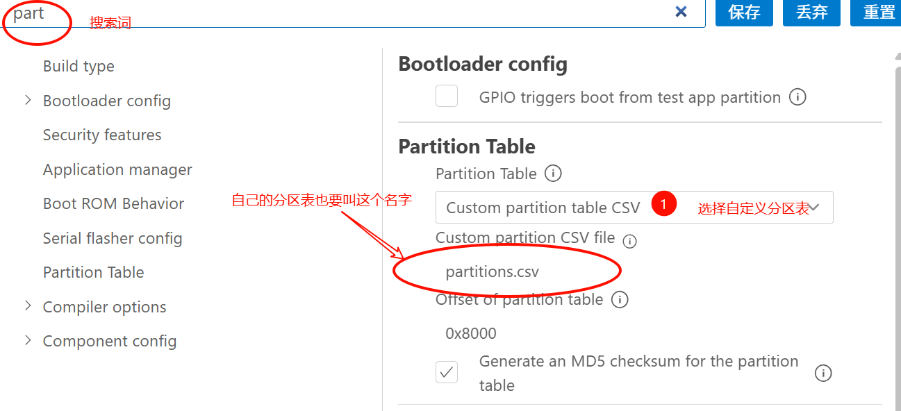
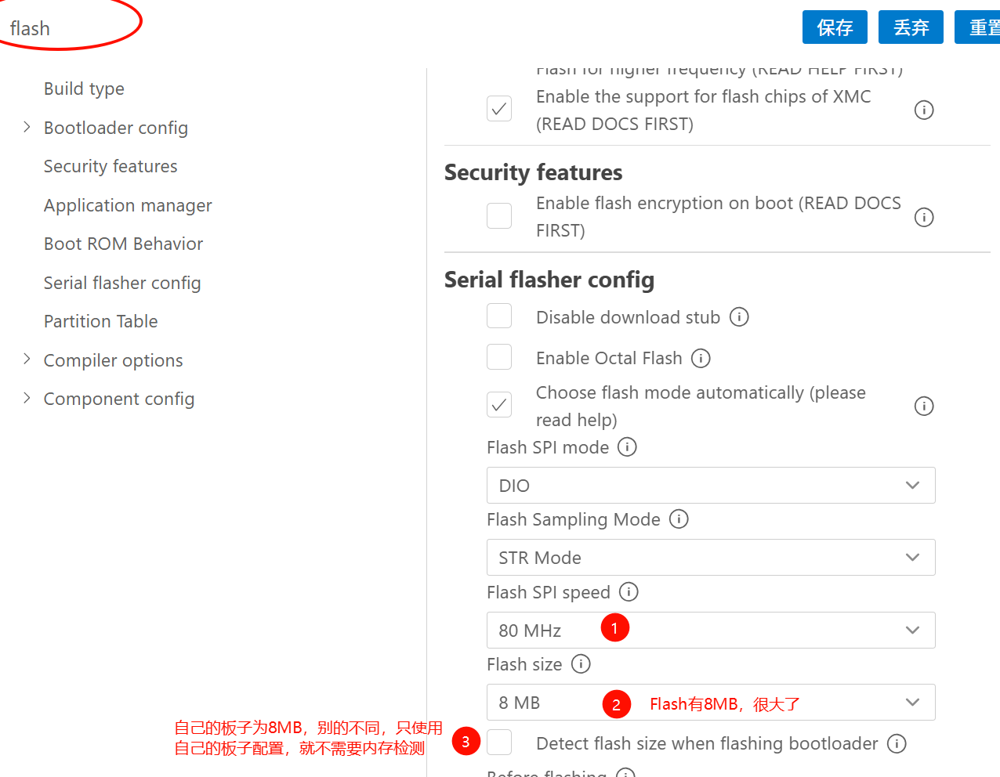
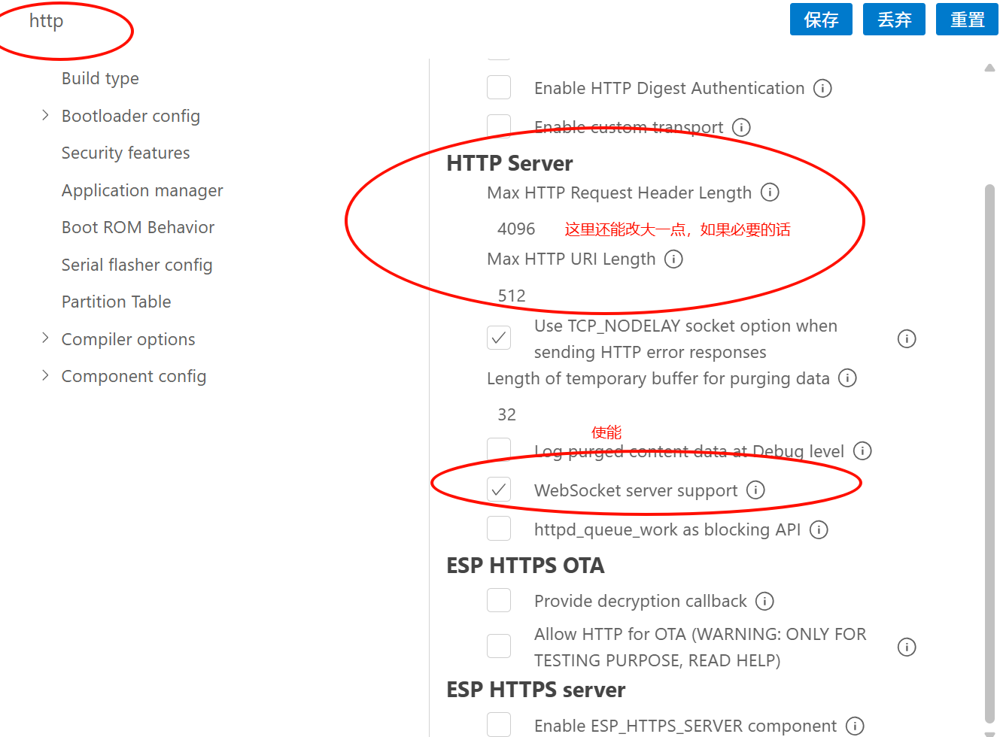

# WebSocket建立要点

## 1. 工程配置(基于OLED已有配置)

### 1-1 配置分区表



* 建立分区表，存储Web的HTML文件

  * 名称：**partitions.csv**
  * 位置：和main文件夹同级（也就是最高级）
  * 内容

  ```c
  # Name,   Type, SubType, Offset,  Size, Flags
  # Note: if you change the phy_init or app partition offset, make sure to change the offset in Kconfig.projbuild
  nvs,      data, nvs,     ,        0x6000,
  phy_init, data, phy,     ,        0x1000,
  factory,  app,  factory, ,        1M,
  # 这是新增的分区,存储HTML,记得把注释删了,回到第6行
  storage,  data, spiffs,  ,        1M  
  ```


## 2. 编写HTML

* 位置：在main文件夹同级定义：**data**文件夹，内部放置文件：**index.html**
  * 名字建议一样，否则还要改分区表和分区函数内容

* ==HTML自己写==

* 添加HTML配置分区指令
  * 在main文件夹（不是main里面）同级的cmakelist里面换行加上：

```c
spiffs_create_partition_image(storage ../data FLASH_IN_PROJECT)
```

## 3. 改写内存配置



## 4. 开启ESP32的HTTP模式



## 5. 编写WebSocket代码

* 自己看现成的库吧，自己配置移植

