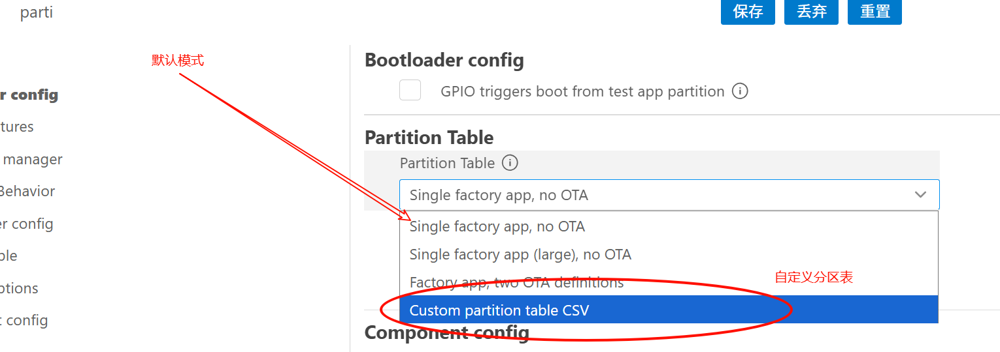
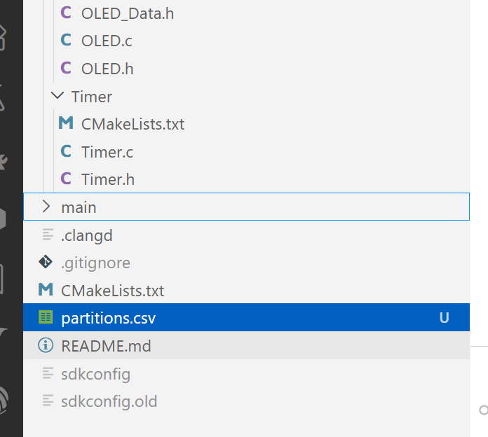

# 分区表

## 1. `bootloder`

0x0000 - 0x8000 - > 存储`bootloder`


## 2. NVS

* 非易失存储


## 3. 默认分区表

```c
# Name,   Type, SubType, Offset,  Size, Flags
# Note: if you have increased the bootloader size, make sure to update the offsets to avoid overlap
nvs,      data, nvs,     ,        0x6000,
phy_init, data, phy,     ,        0x1000,
factory,  app,  factory, ,        1M,       

```

* nvs 24KB
* phy_init 4KB
* factory 1M**(主程序)**


## 4. 系统分区表自定义



